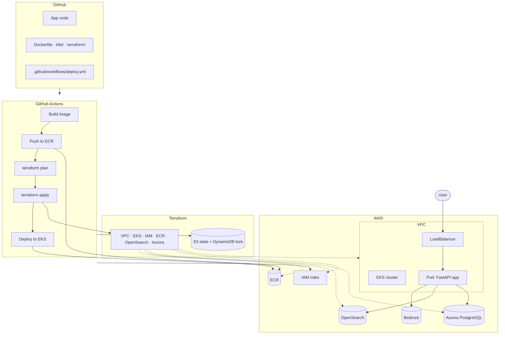
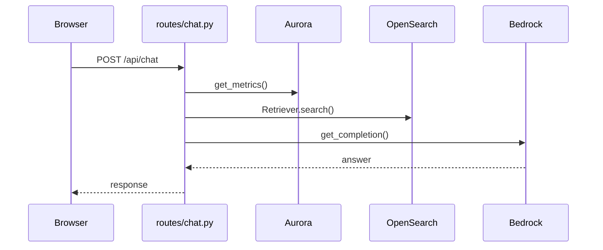
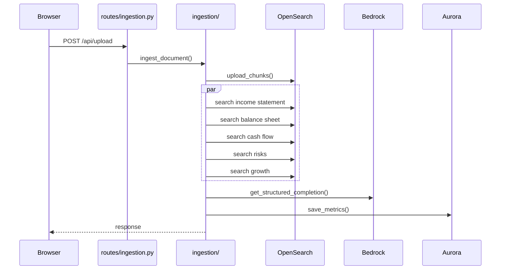

# Investor Intelligence

RAG platform for extracting financial metrics from annual report PDFs and answering questions about them.

```
POST /api/chat {"question": "What was Apple's operating cash flow in fiscal 2024?"}
→ "$118,254 million"
```

Authentication throughout is IAM only. No passwords, API keys, or static credentials for the database, the AI models, or CI/CD.

## Stack

| Layer | Technology |
|---|---|
| API | FastAPI |
| Embeddings | AWS Bedrock, Titan Embed V2 |
| Chat / extraction | AWS Bedrock, Nova 2 Lite |
| Vector search | Amazon OpenSearch Service |
| Database | Aurora PostgreSQL Serverless v2, IAM token auth |
| Container runtime | Docker, Ubuntu 24.04 |
| Orchestration | Amazon EKS, IRSA for pod-level IAM |
| Infrastructure | Terraform |
| CI/CD | GitHub Actions, OIDC federation |

## Architecture



### Chat request



### PDF upload



## Repository layout

| Path | Contents |
|---|---|
| `app.py`, `routes/`, `ingestion/`, `rag/`, `llm/`, `database/`, `vectorstore/`, `static/`, `templates/` | Application code |
| `Dockerfile`, `.dockerignore` | Container image |
| `k8s/` | Kubernetes manifests: Deployment, Service, ConfigMap, ServiceAccount, CI RBAC |
| `terraform/` | AWS infrastructure: VPC, EKS, IAM, ECR, OpenSearch, Aurora, GitHub OIDC role |
| `terraform-remote-state-lock/` | Terraform state backend (S3 bucket, DynamoDB lock table) |
| `.github/workflows/deploy.yml` | CI/CD pipeline |
| `eks/` | Original `eksctl` config and IAM policy documents, superseded by `terraform/` |

## Deploy

Requires an AWS account, AWS CLI configured, Terraform >= 1.5, `kubectl`, Docker, and `gh`.

```bash
git clone https://github.com/space-cowman/investor-intelligence-rag.git
cd investor-intelligence-rag
```

Update the state bucket name and OIDC trust claim for your own account and repo:

```
terraform/main.tf, terraform-remote-state-lock/main.tf:
  bucket = "investor-intelligence-tfstate-<your-account-id>"

terraform/github-actions.tf:
  sub claim should match your GitHub username/repo
```

Create the state backend:

```bash
cd terraform-remote-state-lock
terraform init
terraform apply
cd ..
```

Provision the infrastructure:

```bash
cd terraform
terraform init
terraform plan
terraform apply
```

Point `kubectl` at the cluster and apply the CI pipeline's RBAC:

```bash
aws eks update-kubeconfig --name investor-intelligence --region us-east-1
kubectl apply -f k8s/github-actions-rbac.yaml
```

Build and push the first image:

```bash
aws ecr get-login-password --region us-east-1 | docker login --username AWS --password-stdin <account-id>.dkr.ecr.us-east-1.amazonaws.com
docker build --platform linux/amd64 -t investor-intelligence:latest .
docker tag investor-intelligence:latest <account-id>.dkr.ecr.us-east-1.amazonaws.com/investor-intelligence:latest
docker push <account-id>.dkr.ecr.us-east-1.amazonaws.com/investor-intelligence:latest
```

Deploy the application:

```bash
kubectl apply -f k8s/configmap.yaml -f k8s/deployment.yaml -f k8s/service.yaml -f k8s/serviceaccount.yaml
```

Configure GitHub Actions:

```bash
gh variable set AWS_ROLE_ARN --body "$(cd terraform && terraform output -raw github_actions_role_arn)"
gh variable set ECR_REPOSITORY --body "$(cd terraform && terraform output -raw ecr_repository_url)"
```

Push to `main`. The pipeline handles build, push, `terraform apply`, and deploy from here.

```bash
kubectl get svc investor-intelligence
curl http://<loadbalancer-hostname>/health
```

## Local development

```bash
uv venv && source .venv/bin/activate
uv pip install -r requirements.txt
cp .env.example .env
python -m uvicorn app:app --reload
```

`.env` holds only non-secret configuration (region, model IDs, endpoints). AWS access comes from `~/.aws`.

## Security

- No static credentials: local dev uses `~/.aws`, the pod uses IRSA, CI uses GitHub OIDC
- IAM policies scoped to the specific resources each role needs
- CI cannot read or modify its own RBAC permissions
- AWS account ID resolved at runtime via `data "aws_caller_identity"`, not hardcoded
