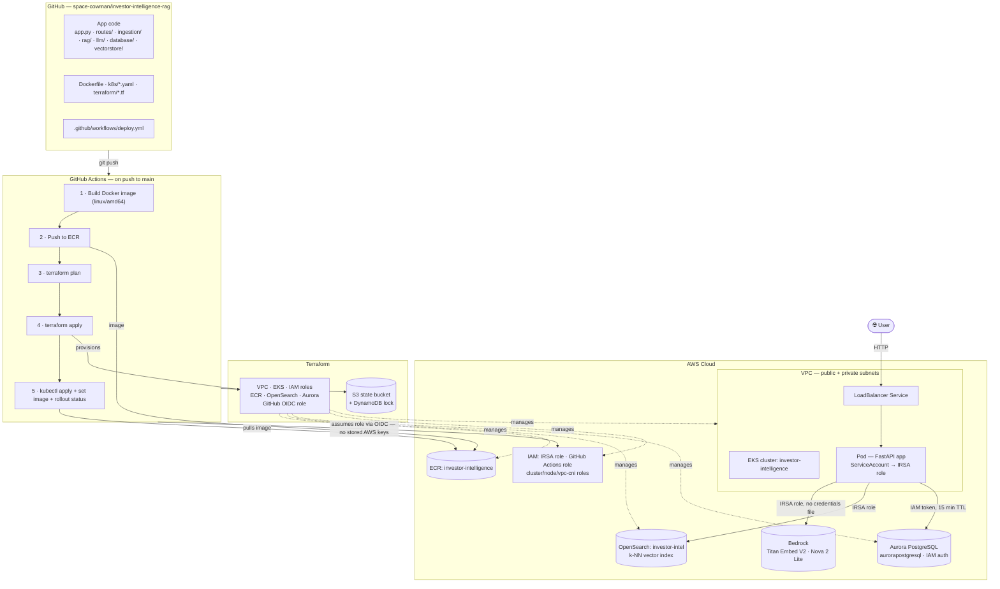
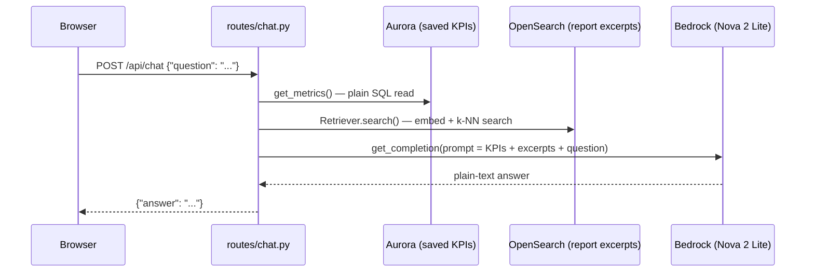
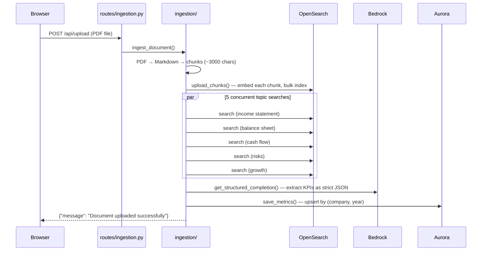

# Investor Intelligence

A RAG (Retrieval-Augmented Generation) platform that reads a company's annual report (10-K PDF), extracts its key financial metrics automatically, and answers plain-English questions about it — "What was Apple's operating cash flow in fiscal 2024?" → **"$118,254 million."**

Everything runs on AWS, authenticated end-to-end via IAM — there is no password, API key, or static credential anywhere in this project, not for the database, not for the AI models, not for CI/CD.

## What this project demonstrates

- **RAG pipeline design** — PDF → Markdown → semantic chunking → embeddings → vector search → structured LLM extraction, with concurrent multi-topic retrieval
- **AWS Bedrock** — Titan Embed V2 for embeddings, Nova 2 Lite for chat/extraction, via the Converse API
- **Vector search** — Amazon OpenSearch Service, k-NN similarity search with metadata filtering
- **IAM-token database auth** — Aurora PostgreSQL Serverless v2 with zero stored passwords; a fresh 15-minute token is generated per new connection
- **Containerization** — a from-scratch Dockerfile (Ubuntu 24.04), built for the right target platform (a real bug hit and fixed during this build — see below)
- **Kubernetes on EKS** — Deployments, Services, ConfigMaps, and **IRSA** (IAM Roles for Service Accounts) so a pod gets scoped AWS access with no credentials file
- **Terraform** — the entire AWS footprint (~30 resources: VPC, EKS, IAM, ECR, OpenSearch, Aurora) codified and **imported from already-running infrastructure** with a verified zero-diff import — a real-world skill distinct from "Terraform from an empty account"
- **GitHub Actions CI/CD** — OIDC federation (no stored AWS keys in GitHub either), least-privilege IAM scoped to exactly this pipeline's job, narrow Kubernetes RBAC so the pipeline can deploy the app but can't touch its own permissions
- **Debugging real cloud infrastructure** — four genuine production-style bugs were hit and fixed while wiring this up (GitHub's OIDC claim format, two IAM permission gaps the Terraform provider needs internally, a privilege-escalation design flaw) — all documented in the commit history, not glossed over

## Architecture



### What happens on a chat question



### What happens on a PDF upload



## Repository layout

| Path | What's in it |
|---|---|
| `app.py`, `routes/`, `ingestion/`, `rag/`, `llm/`, `database/`, `vectorstore/`, `static/`, `templates/` | The FastAPI app and RAG pipeline — everything runs the same whether local, containerized, or on EKS |
| `Dockerfile`, `.dockerignore` | Container image definition (Ubuntu 24.04, Python 3.12) |
| `eks/cluster.yaml` | The original `eksctl` config this cluster was first created from — kept as a historical record |
| `eks/irsa-*.json` | The original hand-written IAM policy JSON (pre-Terraform) — also historical; Terraform now generates the live equivalents inline |
| `k8s/*.yaml` | Kubernetes manifests: Deployment, Service, ConfigMap, ServiceAccount, and the CI pipeline's own scoped RBAC |
| `terraform/` | The live AWS infrastructure, as code — VPC, EKS, IAM, ECR, OpenSearch, Aurora, GitHub OIDC role |
| `terraform-remote-state-lock/` | A tiny, separate, rarely-touched config that creates the S3 bucket + DynamoDB table Terraform's own state lives in (has to be separate — see note in `terraform/main.tf`) |
| `.github/workflows/deploy.yml` | The CI/CD pipeline |

## How this was actually built, in order

The commit history **is** the build log — each stage is a separate, real commit:

1. **Local app** — the RAG pipeline running as a bare `uvicorn` process, authenticating via `~/.aws`
2. **Containerize + EKS** — `Dockerfile`, then a cluster created by hand with `eksctl`, Kubernetes manifests applied by hand with `kubectl`
3. **Terraform** — the infrastructure from step 2 **imported** into Terraform (not recreated — a genuinely different, harder skill than greenfield Terraform), verified zero-diff before anything was touched
4. **GitHub Actions** — CI/CD added on top, once there was something stable (a Terraform-managed, importable state) to automate against

If you're starting fresh rather than adopting existing infrastructure, skip straight to the Terraform step below — there's no reason to hand-build with `eksctl` first unless you specifically want to practice the import workflow.

## Deploy this yourself

Prerequisites: an AWS account, the AWS CLI configured (`aws configure` or SSO), Terraform ≥ 1.5, `kubectl`, Docker, and `gh` (GitHub CLI) authenticated.

**1. Fork or clone this repo, then make it yours:**
```bash
git clone https://github.com/space-cowman/investor-intelligence-rag.git
cd investor-intelligence-rag
```

**2. Pick unique names for account-specific resources.** The Terraform state bucket name must be globally unique across all of AWS, and `terraform`'s `backend` block can't use variables (a Terraform limitation — see the comment in `terraform/main.tf`), so update it directly:
```bash
# terraform/main.tf and terraform-remote-state-lock/main.tf:
#   bucket = "investor-intelligence-tfstate-<your-account-id>"
# terraform/github-actions.tf:
#   the "sub" claim should match YOUR GitHub username/repo, not space-cowman's
```

**3. Create the Terraform state backend** (one-time, rarely touched again):
```bash
cd terraform-remote-state-lock
terraform init
terraform apply
cd ..
```

**4. Provision everything else:**
```bash
cd terraform
terraform init
terraform plan    # review what it's about to create
terraform apply
```
This creates the VPC, EKS cluster, node group, IAM roles (including IRSA and the GitHub Actions OIDC role), ECR repo, OpenSearch domain, and Aurora cluster — about 15-20 minutes, mostly waiting on EKS.

**5. Point `kubectl` at the new cluster, apply the RBAC the pipeline needs** (this one step stays manual, deliberately — see the note in `deploy.yml`):
```bash
aws eks update-kubeconfig --name investor-intelligence --region us-east-1
kubectl apply -f k8s/github-actions-rbac.yaml
```

**6. Build and push the first image** (subsequent builds happen automatically via CI):
```bash
aws ecr get-login-password --region us-east-1 | docker login --username AWS --password-stdin <account-id>.dkr.ecr.us-east-1.amazonaws.com
docker build --platform linux/amd64 -t investor-intelligence:latest .
docker tag investor-intelligence:latest <account-id>.dkr.ecr.us-east-1.amazonaws.com/investor-intelligence:latest
docker push <account-id>.dkr.ecr.us-east-1.amazonaws.com/investor-intelligence:latest
```

**7. Deploy the app manifests:**
```bash
kubectl apply -f k8s/configmap.yaml -f k8s/deployment.yaml -f k8s/service.yaml -f k8s/serviceaccount.yaml
```

**8. Wire up GitHub Actions** — set the two repo variables it needs (Terraform just created the role; read its ARN from the `terraform output`):
```bash
gh variable set AWS_ROLE_ARN --body "$(cd terraform && terraform output -raw github_actions_role_arn)"
gh variable set ECR_REPOSITORY --body "$(cd terraform && terraform output -raw ecr_repository_url)"
```

**9. Push anything to `main`** — the pipeline takes over from here: build, push, `terraform plan`/`apply`, deploy.

**10. Verify:**
```bash
kubectl get svc investor-intelligence   # grab the LoadBalancer hostname
curl http://<that-hostname>/health
```

## Local development (no AWS deployment needed)

```bash
uv venv && source .venv/bin/activate
uv pip install -r requirements.txt
cp .env.example .env   # fill in your own OpenSearch/Aurora endpoints
python -m uvicorn app:app --reload
```

Auth is 100% IAM — no API keys to generate, no `.env` secrets to copy. As long as your AWS CLI credentials (`~/.aws`) can reach Bedrock, OpenSearch, and Aurora, the app runs identically locally, in Docker, and on EKS.

## Security notes

- **No static credentials anywhere** — local dev uses `~/.aws`, the pod uses IRSA, CI uses GitHub OIDC federation. Nothing to leak, nothing to rotate.
- **Least privilege, not convenience** — every IAM role in this project (the app's IRSA role, the CI pipeline's role, the pipeline's own Kubernetes RBAC) is scoped to exactly what it needs, not broad admin access. The CI pipeline specifically *cannot* read or modify its own RBAC permissions — see `k8s/github-actions-rbac.yaml` and the note in `deploy.yml`.
- **No hardcoded AWS account ID in live code** — Terraform resolves it at runtime via `data "aws_caller_identity"`, and the GitHub Actions workflow reads account-specific values from repo variables rather than committed YAML.
